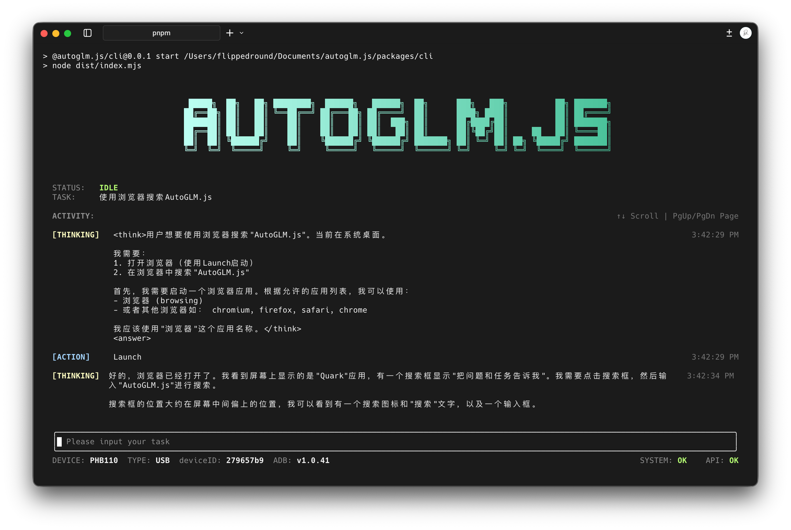

<a href="https://github.com/FliPPeDround/autoglm.js"></a>

<a href="https://github.com/FliPPeDround/autoglm.js"></a>
<a href="https://www.npmjs.com/package/autoglm.js"></a>
<a href="https://www.npmjs.com/package/autoglm.js"></a>
<br/>

<h4 align="center"></h4>

# 基于 JavaScript 实现的 [Open-AutoGLM](https://github.com/zai-org/Open-AutoGLM)

**AutoGLM.js 是一个强大的 AI 代理框架，能够通过自然语言指令自动控制 Android 设备，执行各种复杂的手机操作任务。**



## [`->待办列表<-`](./TODO.md)欢迎参与贡献和反馈！

## 🚀 快速开始

```bash
npx @autoglm.js/cli
```

> 模型可以直接使用GLM免费提供的 [`autoglm-phone`](https://www.bigmodel.cn/glm-coding?ic=PWCU0E7KAJ) 模型。

## ✨ 特性

- 🎯 **自然语言控制**: 通过简单的文字指令控制手机操作
- 📱 **Android 自动化**: 支持截图分析、应用操作、UI 交互等
- 🧠 **智能决策**: 基于大语言模型的智能任务规划和执行
- 🔧 **灵活配置**: 支持多种调用方式和配置选项
- 🌍 **多语言支持**: 内置中英文支持
- 📦 **多种使用方式**: 提供 CLI、API 和桌面应用三种使用方式

### 环境要求

- Node.js >= 20.0.0

## 📖 使用方式

AutoGLM.js 提供三种使用方式：**CLI 命令行工具**、**核心 API 集成** 和 **桌面应用[🚧 施工中]**。

### 方式一：CLI 命令行工具

#### 1. 全局安装

```bash
# 从 npm 安装
npm install -g @autoglm.js/cli
```

#### 2. 创建配置文件

创建 `~/.autoglm/config.json` 文件：

```json
{
  "$schema": "https://unpkg.com/autoglm.js@latest/schema/agent-config.schema.json",
  "maxSteps": 200,
  "lang": "cn",
  "baseUrl": "https://open.bigmodel.cn/api/paas/v4/",
  "apiKey": "your-api-key-here",
  "model": "autoglm-phone",
  "deviceId": "your-device-id"
}
```

#### 3. 运行 CLI

```bash
autoglm
```

#### 4. 交互式使用

CLI 会启动交互式界面，你可以输入自然语言指令：

```
💬 请输入任务：打开微信并给张三发送"你好"
```

### 方式二：核心 API 集成

#### 1. 安装核心库

```bash
npm install autoglm.js
```

#### 2. 基础使用

```javascript
import { AutoGLM } from 'autoglm.js'

// 创建代理实例
const agent = new AutoGLM({
  maxSteps: 200,
  lang: 'cn',
  baseUrl: 'https://open.bigmodel.cn/api/paas/v4/',
  apiKey: 'your-api-key-here',
  model: 'autoglm-phone',
  deviceId: 'your-device-id'
})

// 执行任务
agent.run('打开微信并给张三发送"你好"')
```

#### 3. 事件监听

```javascript
import { AutoGLM, EventType } from 'autoglm.js'

const agent = new AutoGLM({
  baseUrl: 'https://open.bigmodel.cn/api/paas/v4/',
  apiKey: 'your-api-key-here',
  model: 'autoglm-phone',
})

// 监听所有事件
agent.on('*', (type, data) => {
  console.log(`[${type}]`, data)
})

// 监听特定事件
agent.on(EventType.Thinking, (data) => {
  console.log('思考中:', data)
})

agent.on(EventType.TaskComplete, (result) => {
  console.log('任务完成:', result)
})

// 执行任务
agent.run('打开抖音')
```

### 方式三：桌面应用 [WIP]

桌面应用正在开发中，将提供图形化界面来使用 AutoGLM.js 的所有功能。欢迎参与贡献和反馈。

## ⚙️ 配置选项

### 基础配置

| 参数                | 类型   | 默认值 | 说明                    |
| ------------------- | ------ | ------ | ----------------------- |
| `maxSteps`          | number | 100    | 最大执行步骤数          |
| `lang`              | string | 'cn'   | 语言设置 ('cn' 或 'en') |
| `deviceId`          | string | -      | Android 设备 ID         |
| `systemPrompt`      | string | -      | 自定义系统提示词        |
| `screenshotQuality` | number | 80     | 截图质量（1-100）       |

### 模型配置

| 参数               | 类型   | 默认值                     | 说明          |
| ------------------ | ------ | -------------------------- | ------------- |
| `baseUrl`          | string | 'http://localhost:8000/v1' | API 基础地址  |
| `apiKey`           | string | -                          | API 密钥      |
| `model`            | string | 'autoglm-phone'            | 模型名称      |
| `maxTokens`        | number | 3000                       | 最大 token 数 |
| `temperature`      | number | 0.0                        | 温度参数      |
| `topP`             | number | 0.85                       | Top P 参数    |
| `frequencyPenalty` | number | 0.2                        | 频率惩罚参数  |

## 📄 许可证

本项目基于 [MIT 许可证](LICENSE) 开源。

## 🙏 致谢

- [Open-AutoGLM](https://github.com/zai-org/Open-AutoGLM) - 原始项目灵感

## 📞 支持

- 💬 [提交 Issue](https://github.com/flippedround/autoglm.js/issues)
- 📧 邮件: flippedround@qq.com
- 💖 [赞助项目](https://afdian.com/a/flippedround)

## 🙇🏻‍♂️[Sponsors](https://afdian.com/a/flippedround)

<p align="center">
  <a href="https://afdian.com/a/flippedround">
    
  </a>
</p>

---

<div align="center">
  <p>如果这个项目对你有帮助，请给个 ⭐️ 支持一下！</p>
  <p><b>Made with ❤️ by <a href="https://github.com/flippedround">@FliPPeDround</a></b></p>
</div>
